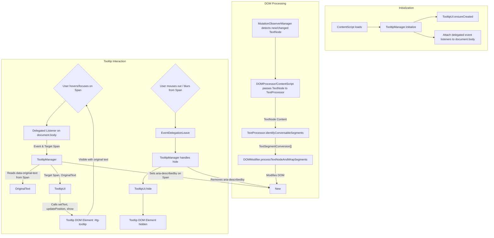

# Plan: Implement Hover Tooltip Showing Original Unconverted Text

## Chosen Approach (One‑liner)
Wrap each converted text segment in a `<span>` element with a `data-original-text` attribute, and implement a custom, accessible, and dynamically managed tooltip displayed on hover/focus using event delegation.

---

## Architecture Blueprint

### **Modules / Packages**

-   **`ContentScript (content-consolidated.js)`**
    -   _Responsibility:_ Orchestrates initialization of all content script modules, including the `TooltipManager`. Manages the overall lifecycle.
-   **`TextProcessor (text-processor.js)`**
    -   _Responsibility:_ Identifies text segments for conversion based on `TrumpMappings`. Returns information about original and converted text segments, including their start/end positions within a text node, but *does not* directly modify the DOM.
-   **`DOMModifier (dom-modifier.js - New or refactored from dom-processor.js)`**
    -   _Responsibility:_ Consumes information from `TextProcessor`. Performs the actual DOM manipulation: splitting text nodes and inserting `<span>` wrapper elements around converted text. Assigns `data-original-text` attributes and a specific class for identification.
-   **`TooltipManager (tooltip-manager.js - New)`**
    -   _Responsibility:_ Manages tooltip lifecycle and interactions. Initializes event listeners (delegated), determines when to show/hide the tooltip based on user actions (hover, focus), and coordinates with `TooltipUI`. Handles ARIA attribute management on trigger elements.
-   **`TooltipUI (tooltip-ui.js - New)`**
    -   _Responsibility:_ Manages the tooltip's DOM element itself. Handles creation, styling, content updates (`textContent`), positioning (including viewport collision detection), and visibility (show/hide methods).
-   **`MutationObserverManager (mutation-observer-manager.js - Existing)`**
    -   _Responsibility:_ Detects DOM changes. Will need to correctly process text within newly added DOM nodes and ensure `DOMModifier` and `TooltipManager` can handle dynamic content.
-   **`TrumpMappings (trump-mappings.js - Existing)`**
    -   _Responsibility:_ Provides the text conversion rules.
-   **`Logger (logger.js - Existing)`**
    -   _Responsibility:_ Provides structured logging capabilities.
-   **`ErrorHandler (error-handler.js - Existing)`**
    -   _Responsibility:_ Provides global error handling and protection wrappers.

### **Public Interfaces / Contracts**

```typescript
// types.d.ts or a new types/tooltip.ts

interface TextSegmentConversion {
  originalText: string;
  convertedText: string;
  startIndex: number; // Index within the original text node
  endIndex: number;   // Index within the original text node
}

// --- TextProcessor ---
interface TextProcessor {
  /**
   * Processes a text node and returns an array of segments that need conversion.
   * Does NOT modify the DOM.
   */
  identifyConversableSegments(
    textNodeContent: string,
    replacementMap: any, // Type from TrumpMappings
    mapKeys: string[]
  ): TextSegmentConversion[];
}

// --- DOMModifier ---
interface DOMModifier {
  /**
   * Processes a text node, replacing segments based on conversion info.
   * Wraps converted segments in spans with data attributes.
   * Returns true if modifications were made, false otherwise.
   */
  processTextNodeAndWrapSegments(
    textNode: Text,
    segments: TextSegmentConversion[]
  ): boolean;

  // Internal constant for the wrapper class
  // static readonly CONVERTED_TEXT_WRAPPER_CLASS = "tg-converted-text";
  // static readonly ORIGINAL_TEXT_DATA_ATTR = "data-original-text";
}

// --- TooltipUI ---
interface TooltipUI {
  /** Ensures the tooltip DOM element is created and ready. */
  ensureCreated(): void;

  /** Sets the text content of the tooltip. Must use textContent for security. */
  setText(text: string): void;

  /** Calculates and applies the tooltip's position relative to the target element, avoiding viewport overflow. */
  updatePosition(targetElement: HTMLElement): void;

  /** Makes the tooltip visible and updates ARIA attributes. */
  show(): void;

  /** Hides the tooltip and updates ARIA attributes. */
  hide(): void;

  /** Removes the tooltip element from the DOM. */
  destroy(): void;

  /** Returns the ID of the tooltip element for ARIA linking. */
  getId(): string;
}

// --- TooltipManager ---
interface TooltipManager {
  /** Initializes event listeners and dependencies. */
  initialize(tooltipUI: TooltipUI): void;

  /** Cleans up event listeners and resources. */
  dispose(): void;
}
```

### **Data Flow Diagram** (Mermaid)



### **Error & Edge‑Case Strategy**

-   **DOM Modification Failures:** All `DOMModifier` operations will be wrapped in `ErrorHandler.protect`. If node splitting or insertion fails, log the error with context (node info, segment data) and revert to the original text node content to prevent breaking page layout.
-   **Missing `data-original-text`:** If `TooltipManager` encounters a trigger span without the `data-original-text` attribute, it will log a warning and not display the tooltip. This indicates a bug in `DOMModifier`.
-   **Tooltip Positioning:** `TooltipUI.updatePosition` will implement robust logic to:
    -   Calculate position relative to the target `<span>`.
    -   Detect viewport boundaries and dynamically adjust position (e.g., flip from top to bottom, left to right) to prevent overflow.
    -   Consider scroll events: hide or reposition tooltip on scroll.
-   **Long/Multiline Original Text:** Tooltip CSS will define `max-width` and `max-height`. Overflowing text will use `text-overflow: ellipsis;` or allow scrolling within the tooltip if deemed necessary. Full text will always be available to screen readers via ARIA.
-   **Z-index Conflicts:** Tooltip will use a very high `z-index`. This is a known, generally unavoidable risk for overlay elements.
-   **Rapid Hovering (Flickering):** `TooltipManager` may implement a slight delay (e.g., 50-100ms) before showing the tooltip and a corresponding delay or immediate hide on mouseout to prevent flickering.
-   **Accessibility Failures:** If core ARIA attributes cannot be set or tooltip logic fails, ensure no JS errors break the page. Fallback to browser's native `title` attribute on the span is a last resort if the custom tooltip is entirely non-functional (though undesirable).

---

## Detailed Build Steps

1.  **Refactor `TextProcessor` for Segment Identification**:
    *   Modify `TextProcessor` to expose a method like `identifyConversableSegments(textNodeContent, replacementMap, mapKeys)`.
    *   This method returns an array of `TextSegmentConversion` objects, detailing original/converted text and start/end indices within the source text node. It *must not* modify the DOM.

2.  **Implement `DOMModifier` for Text Wrapping**:
    *   Create `dom-modifier.js`.
    *   Implement `processTextNodeAndWrapSegments(textNode, segments)`:
        *   Iterate through the text node content, using `segments` info from `TextProcessor`.
        *   For each segment to be converted:
            *   Carefully split the `TextNode` to isolate the segment.
            *   Create a `<span>` element.
            *   Set `span.className = "tg-converted-text"`.
            *   Set `span.setAttribute("data-original-text", segment.originalText)`.
            *   Set `span.textContent = segment.convertedText`.
            *   **Accessibility**: Set `span.setAttribute("tabindex", "0")` to make it focusable.
            *   Insert the `<span>` into the DOM in place of the original text segment.
        *   Ensure surrounding non-converted parts of the original text node are preserved as separate text nodes.
        *   Mark the new `<span>` (e.g., with a temporary attribute or by checking its class) to prevent re-processing by `MutationObserverManager` if it triggers further mutations.

3.  **Implement `TooltipUI` Module**:
    *   Create `tooltip-ui.js`.
    *   `ensureCreated()`: Lazily creates a single `div` element (e.g., `<div id="tg-tooltip" role="tooltip" aria-hidden="true"></div>`). Appends to `document.body`.
    *   `setText(text)`: Sets `tooltipElement.textContent = text`. **CRITICAL**: Always use `textContent`, never `innerHTML`, to prevent XSS.
    *   `updatePosition(targetElement)`: Calculates position relative to `targetElement.getBoundingClientRect()`. Implements viewport collision detection and adjustment logic (e.g., flip tooltip if near edge).
    *   `show()`: Sets `tooltipElement.style.visibility = "visible"`, `tooltipElement.style.opacity = "1"`, `tooltipElement.setAttribute("aria-hidden", "false")`.
    *   `hide()`: Sets `tooltipElement.style.opacity = "0"`, `tooltipElement.style.visibility = "hidden"`, `tooltipElement.setAttribute("aria-hidden", "true")`. Transition opacity for smooth effect.
    *   `destroy()`: Removes the tooltip element from DOM.
    *   `getId()`: Returns the ID of the tooltip element (e.g., "tg-tooltip").
    *   Inject CSS for the tooltip:
        *   Scoped using the ID (e.g., `#tg-tooltip`).
        *   Styles: `position: fixed` (or `absolute` if relative to a specific container), `background`, `color`, `padding`, `border-radius`, `font-size`, high `z-index`, `pointer-events: none` (tooltip itself should not be interactive).
        *   Transition for `opacity`.
        *   Define `max-width`, `max-height`, `overflow`, `word-wrap`.

4.  **Implement `TooltipManager` Module**:
    *   Create `tooltip-manager.js`.
    *   `initialize(tooltipUI)`:
        *   Store `tooltipUI` instance. Call `tooltipUI.ensureCreated()`.
        *   Attach event listeners to `document.body` for `mouseover`, `mouseout`, `focusin`, `focusout` using event delegation, targeting `.tg-converted-text` elements.
        *   On `mouseover`/`focusin` for a valid target:
            1.  Retrieve `originalText` from `target.dataset.originalText`.
            2.  If `originalText` is valid:
                a.  `tooltipUI.setText(originalText)`.
                b.  `tooltipUI.updatePosition(target)`.
                c.  `tooltipUI.show()`.
                d.  `target.setAttribute("aria-describedby", tooltipUI.getId())`.
        *   On `mouseout`/`focusout` for a valid target:
            1.  `tooltipUI.hide()`.
            2.  `target.removeAttribute("aria-describedby")`.
        *   Add a `keydown` listener to `document` to hide tooltip if `Escape` key is pressed when tooltip is visible.
    *   `dispose()`: Remove all event listeners and call `tooltipUI.destroy()`.

5.  **Integrate Modules in `ContentScript (content-consolidated.js)`**:
    *   Instantiate and initialize `TooltipUI` and `TooltipManager`.
    *   Ensure `DOMModifier.processTextNodeAndWrapSegments` is called by the existing DOM processing logic (likely triggered by `MutationObserverManager` or initial page scan) with segments identified by `TextProcessor`.
    *   Manage disposal of `TooltipManager` if the content script is unloaded.

6.  **Accessibility Hardening**:
    *   Confirm `tabindex="0"` on wrapper spans allows keyboard focus.
    *   Verify `aria-describedby` correctly links span to tooltip content for screen readers.
    *   Ensure `role="tooltip"` is on the tooltip element.
    *   Test with screen readers (NVDA, VoiceOver, JAWS if possible) and keyboard-only navigation.
    *   Ensure sufficient color contrast for tooltip text/background.

7.  **Performance Optimization & Testing**:
    *   Benchmark DOM modification on large pages.
    *   Ensure event delegation is performant.
    *   Profile tooltip show/hide and positioning logic.

---

## Testing Strategy

-   **Unit Tests (Vitest/Jest with JSDOM)**:
    -   `TextProcessor`:
        -   Verify `identifyConversableSegments` correctly identifies segments and returns accurate original/converted text and indices for various inputs (no matches, single match, multiple matches, matches at start/end/middle of text).
    -   `DOMModifier`:
        -   Test `processTextNodeAndWrapSegments` with mock text nodes and segment data.
        -   Verify correct DOM structure (spans, text nodes, attributes: `class`, `data-original-text`, `tabindex`).
        -   Test edge cases: empty text nodes, segments spanning entire node, no segments.
    -   `TooltipUI`:
        -   Test `ensureCreated()`: element is created with correct ID, role, initial ARIA state.
        -   Test `setText()`: `textContent` is correctly set (verify no `innerHTML` usage).
        -   Test `show()`/`hide()`: style changes and `aria-hidden` attribute toggled.
        -   Test `updatePosition()`: mock `getBoundingClientRect` for target and window, verify calculated styles.
        -   Test `getId()`.
    -   `TooltipManager`:
        -   Mock `TooltipUI`.
        -   Simulate delegated `mouseover`, `mouseout`, `focusin`, `focusout`, `keydown` events on a mock DOM structure.
        -   Verify calls to mocked `TooltipUI` methods (`setText`, `updatePosition`, `show`, `hide`).
        -   Verify `aria-describedby` attribute management on target elements.
-   **Integration Tests (JSDOM or browser test runner like Playwright/Cypress for components)**:
    -   Test the flow: `TextProcessor` -> `DOMModifier` -> `TooltipManager` -> `TooltipUI`.
    -   Create a sample DOM, trigger text processing.
    -   Simulate user interactions (hover, focus) on generated `<span>` elements.
    -   Verify the tooltip appears with correct content and ARIA attributes are set.
-   **E2E Tests (Playwright/Cypress)**:
    -   Load the extension in a real browser.
    -   Navigate to pages with known convertible text.
    -   Automate hover and focus interactions.
    -   Visually verify tooltip appearance and position (snapshot testing if feasible).
    -   Test keyboard navigation (Tab to spans, tooltip appears; Escape dismisses).
    -   Test on pages with dynamic content updates.
-   **What to Mock**:
    -   In unit tests, direct dependencies are mocked (e.g., `TooltipUI` for `TooltipManager`).
    -   Browser APIs like `getBoundingClientRect` for `TooltipUI` positioning tests.
    -   Avoid mocking internal modules being tested together in integration tests.
-   **Coverage Targets**:
    -   Unit Tests: >90% for new modules (`DOMModifier`, `TooltipManager`, `TooltipUI`) and critical logic in `TextProcessor`.
    -   Integration Tests: Cover key user flows and interactions between modules.
    -   E2E Tests: Cover primary success paths and critical accessibility features.

---

## Logging & Observability

-   Utilize existing `Logger` module with structured JSON output.
-   **Log Events (with `component` field: "TooltipManager", "TooltipUI", "DOMModifier")**:
    -   `INFO`: `TooltipManager.initialize`, `TooltipManager.dispose`.
    -   `DEBUG`: "Tooltip shown", fields: `{targetElementTag: string, targetElementClasses: string, originalTextSnippet: string}`.
    -   `DEBUG`: "Tooltip hidden".
    -   `DEBUG`: "Wrapped converted text segment", fields: `{originalTextSnippet: string, convertedTextSnippet: string}` (by `DOMModifier`).
    -   `WARN`: "Target span missing data-original-text attribute", fields: `{targetElementDetails: string}`.
    -   `ERROR`: "Error during tooltip operation", fields: `{error: string, stackTrace: string, operation: string (e.g., 'positioning', 'eventHandling')}`.
    -   `ERROR`: "Error during DOM modification for wrapping", fields: `{error: string, stackTrace: string, textNodeContentSnippet: string}`.
-   **Correlation ID Propagation**: Ensure existing correlation ID mechanisms are applied to logs generated by these new modules if applicable within the content script context.

---

## Security & Config

-   **Input Validation Hotspots**:
    -   `TooltipUI.setText()`: **MUST** use `element.textContent = originalText`. Never use `innerHTML` with `originalText` to prevent XSS vulnerabilities if the original page content (and thus `originalText`) contains malicious HTML.
-   **Secrets Handling**: Not applicable for this feature.
-   **Least-Privilege Notes**:
    -   DOM modifications by `DOMModifier` are scoped to text nodes and the spans it creates.
    -   `TooltipUI` appends a single element to `document.body` and styles it.
    -   Event listeners on `document.body` are delegated and only act on specific target elements (`.tg-converted-text`).

---

## Documentation

-   **Code Self-Doc Patterns**:
    -   TSDoc/JSDoc comments for all new public interfaces, classes, methods, and complex functions, explaining purpose, parameters, returns, and side effects.
    -   Clear, descriptive names for variables, functions, classes.
-   **`README.md` Updates**:
    -   Add the "Hover Tooltip for Original Text" feature to the features list.
    -   Briefly explain how it works and its benefits (transparency).
    -   Mention accessibility support (keyboard navigation, screen reader compatibility).
-   **`docs/architecture.md` Updates**:
    -   Add new modules (`DOMModifier`, `TooltipManager`, `TooltipUI`) to the architecture diagram and descriptions.
    -   Update data flow diagrams to include the tooltip interaction.
-   **`docs/behavior.md` (or similar user-facing doc) Updates**:
    -   Describe how users can access the original text using hover or keyboard focus.

---

## Risk Matrix

| Risk                                                                    | Severity | Mitigation                                                                                                                                                                                             |
| ----------------------------------------------------------------------- | -------- | ------------------------------------------------------------------------------------------------------------------------------------------------------------------------------------------------------ |
| Performance degradation on pages with many conversions (DOM manipulation) | High     | Efficient node splitting in `DOMModifier`. Batch DOM updates if necessary (though `MutationObserver` helps). Rigorous performance testing on complex pages.                                              |
| Accessibility issues (keyboard navigation, screen reader compatibility)   | High     | Implement `tabindex="0"` on spans, `focusin`/`focusout` handlers, ARIA attributes (`role="tooltip"`, `aria-describedby`, `aria-hidden`). Thorough testing with assistive technologies.                  |
| Tooltip positioning errors (off-screen, obscuring content)              | Medium   | Robust viewport collision detection and dynamic repositioning logic in `TooltipUI`. Test on various screen sizes and with elements near viewport edges.                                                  |
| CSS conflicts with host page styles                                     | Medium   | Highly specific, namespaced CSS selectors (e.g., `#tg-tooltip .tg-tooltip-content`). Use `all: initial` selectively if needed. Shadow DOM for tooltip as a final, complex resort if conflicts are severe. |
| Increased complexity in DOM processing logic                            | Medium   | Clear separation of concerns: `TextProcessor` (identifies), `DOMModifier` (acts). Extensive unit tests for `DOMModifier`'s node manipulation.                                                            |
| Mobile/Touch device usability (hover is not a primary interaction)      | Medium   | Feature primarily targets "hover". Document this. Future enhancement could add tap/long-press for touch. Ensure current implementation doesn't break touch interactions.                               |
| XSS via original text if `innerHTML` is used for tooltip content        | Critical | **Strictly use `textContent`** when populating the tooltip with `originalText`. Code reviews to enforce this.                                                                                          |
| Memory leaks from event listeners or DOM elements                       | Low      | Ensure `TooltipManager.dispose()` correctly removes all event listeners. `TooltipUI.destroy()` removes the tooltip element. Delegated listeners reduce per-element listener count.                   |
| Cross-browser inconsistencies                                           | Low      | Use standard DOM APIs and CSS. Test on all supported browsers (Chrome, Firefox, Edge).                                                                                                                 |

---

## Open Questions

1.  **Tooltip Content Styling**: How should very long or pre-formatted (e.g., with multiple spaces, newlines) `originalText` be displayed in the tooltip? (Current plan: `max-width`/`height`, `ellipsis` or scroll, `white-space: pre-wrap` if appropriate).
2.  **Tooltip Interaction on Touch Devices**: While "hover" is the requirement, should there be any consideration for touch devices (e.g., disable, or plan for a future tap/long-press enhancement)? (Current plan: Focus on hover/keyboard. No specific touch implementation in this iteration).
3.  **Configuration**: Will users need to configure tooltip behavior (e.g., delay, position preference, disable)? (Current plan: No user configuration in this iteration. Defaults will be chosen for good UX).
4.  **Visual Coordination**: If converted text itself gets a distinct visual style (e.g., background color), how should the tooltip interact/coordinate with that? (Current plan: Assumed independent, but the wrapper `<span>` can facilitate both).
5.  **Tooltip Dismissal**: Beyond `mouseout`/`blur` and `Escape` key, are other dismissal methods needed (e.g., click outside)? (Current plan: `mouseout`/`blur`/`Escape` should suffice for typical tooltip behavior).